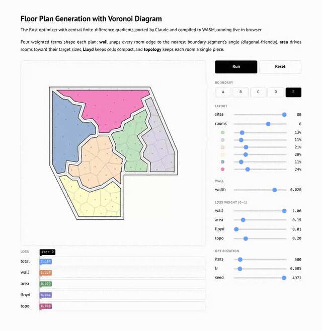
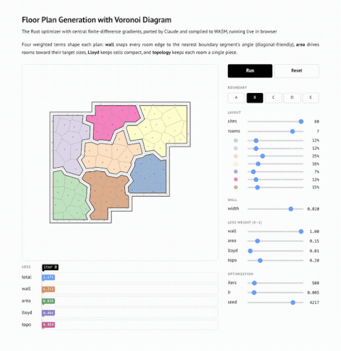

# free-form-floor-plan-design-using-differentiable-voronoi-diagram

Naive implementation of the paper Free-form Floor Plan Design using Differentiable Voronoi Diagram. The paper differentiates the Voronoi diagram analytically; this approximates the gradients numerically instead (central finite-differences) and seeds rooms with KMeans for faster convergence. A Python implementation pairs `Shapely` geometry with `PyTorch` autograd over those numerical gradients; a Rust port reproduces the same algorithm with pure-Rust geometry (`geo` + `voronoice`) and no autograd — ~11× faster, compiled to <b>WASM</b> for the live [in-browser demo](https://parkcheolhee-lab.github.io/free-form-floor-plan-design-using-differentiable-voronoi-diagram/).

<br>


<p align="center">
    
    
</p>
<p align="center" color="gray">
  <i>
  In-browser Demo
  </i>
</p>


# Installation

This repository ships **two** dev containers, selectable from the same "Reopen in Container" picker:

- **voronoi-floorplan-python** — the original implementation, image `python:3.10.12-slim` ([`.devcontainer/python/Dockerfile`](/.devcontainer/python/Dockerfile)).
- **voronoi-floorplan-rust** — the pure-Rust port, image `rust:1-slim-bookworm` ([`.devcontainer/rust/Dockerfile`](/.devcontainer/rust/Dockerfile)).


1. Ensure you have Docker and Visual Studio Code with the Remote - Containers extension installed.
2. Clone the repository.

    ```
        git clone https://github.com/PARKCHEOLHEE-lab/free-form-floor-plan-design-using-differentiable-voronoi-diagram.git
    ```

3. Open the project with VSCode.
4. When prompted at the bottom left on the VSCode, click `Reopen in Container` or use the command palette (F1) and select `Dev Containers: Reopen in Container`. VS Code lists both configurations — pick **voronoi-floorplan-python** or **voronoi-floorplan-rust**.
5. VS Code will build the Docker container and set up the environment.
6. Once the container is built and running, you're ready to start working with the project.
