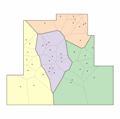
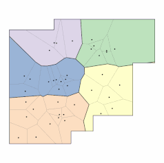
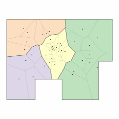
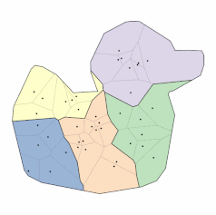

# free-form-floor-plan-design-using-differentiable-voronoi-diagram

This project is a naive implementation of the paper [Free-form Floor Plan Design using Differentiable Voronoi Diagram](https://www.dropbox.com/scl/fi/culi7j1v14r9ax98rfmd6/2024_pg24_floorplan.pdf?rlkey=s5xwncuybrtsj5vyphhn61u0h&e=3&dl=0). The paper is based on the <b>differentiable Voronoi diagram</b>, but this repository uses `Shapely` and `Pytorch`. Specifically, PyTorch's autograd functionality for <b>numerical differentiation</b> is combined with Shapely's geometric operations to compute gradients. Also, the initialization method to assign room cells is different. I used the KMeans to converge the result faster than random initialization.
<mark>The detailed process for this project is archived [__here__](https://parkcheolhee-lab.github.io/floor-plan-generation-with-voronoi-diagram/).</mark>

<br>

<div style="display: flex">
    <p align="center">
        　　
        　　
        　　
        
    </p>
</div>
<p align="center" color="gray">
  <i>
  Optimization processes for <br>shape_a.py · shape_b.py · shape_c.py · shape_duck
  </i>
</p>

# Implementations

| Directory | What it is |
|---|---|
| [`python/`](free_form_floor_plan_design_using_differentiable_voronoi_diagram/python/README.md) | The original implementation — PyTorch autograd over numerical differentiation + Shapely. |
| [`rust/`](free_form_floor_plan_design_using_differentiable_voronoi_diagram/rust/README.md) | A pure-Rust port — same algorithm, no GEOS/autograd, verified equivalent and ~11× faster. |
| [`comparison/`](free_form_floor_plan_design_using_differentiable_voronoi_diagram/comparison/README.md) | Side-by-side timing and evolution-GIF comparison of the two. |

# Installation

This repository ships **two** dev containers, selectable from the same "Reopen in Container" picker:

- **voronoi-floorplan-python** — the original implementation, image `python:3.10.12-slim` ([`.devcontainer/python/Dockerfile`](/.devcontainer/python/Dockerfile)).
- **voronoi-floorplan-rust** — the pure-Rust port, image `rust:1-slim-bookworm` ([`.devcontainer/rust/Dockerfile`](/.devcontainer/rust/Dockerfile)).


1. Ensure you have Docker and Visual Studio Code with the Remote - Containers extension installed.
2. Clone the repository.

    ```
        git clone https://github.com/PARKCHEOLHEE-lab/free-form-floor-plan-design-using-differentiable-voronoi-diagram.git
    ```

3. Open the project with VSCode.
4. When prompted at the bottom left on the VSCode, click `Reopen in Container` or use the command palette (F1) and select `Dev Containers: Reopen in Container`. VS Code lists both configurations — pick **voronoi-floorplan-python** or **voronoi-floorplan-rust**.
5. VS Code will build the Docker container and set up the environment.
6. Once the container is built and running, you're ready to start working with the project.

See each implementation's own README for usage:
[`python/`](free_form_floor_plan_design_using_differentiable_voronoi_diagram/python/README.md) ·
[`rust/`](free_form_floor_plan_design_using_differentiable_voronoi_diagram/rust/README.md) ·
[`comparison/`](free_form_floor_plan_design_using_differentiable_voronoi_diagram/comparison/README.md)
